## 第一部分：机器学习核心概念梳理

### 概念关系图谱

```
人工智能（AI）
│
├── 机器学习（ML）
│   ├── 传统机器学习算法
│   │   ├── 监督学习（线性回归、逻辑回归、决策树、SVM）
│   │   ├── 无监督学习（聚类、降维、关联规则）
│   │   └── 强化学习
│   │
│   └── 深度学习（DL）
│       ├── 神经网络基础（感知机、多层感知机MLP）
│       ├── 卷积神经网络（CNN）
│       │   ├── LeNet、AlexNet、VGG
│       │   ├── ResNet（残差网络）
│       │   └── 目标检测系列（R-CNN、YOLO）
│       │
│       ├── 循环神经网络（RNN）
│       │   ├── LSTM（长短期记忆网络）
│       │   └── GRU（门控循环单元）
│       │
│       └── Transformer架构
│           ├── BERT（双向编码器）
│           ├── GPT系列（自回归解码器）
│           └── 多模态模型（ViT、CLIP）
│
├── 大语言模型（LLM）：深度学习的模型产物，文本类的生成式AI
└─— 生成式AI
```

### 概念详细解释

#### 1. 机器学习（Machine Learning）
**核心机制**：通过数据训练模型，使计算机无需明确编程就能学习规律。
- **监督学习**：有标签数据，学习输入到输出的映射
- **无监督学习**：无标签数据，发现数据内在结构
- **半监督学习**：少量标签+大量无标签数据
- **强化学习**：通过与环境交互获得奖励信号学习

#### 2. 神经网络（Neural Networks）
**底层原理**：模拟生物神经元的数学模型
- **神经元**：输入×权重 + 偏置 → 激活函数 → 输出
- **前向传播**：数据从输入层流向输出层
- **反向传播**：计算梯度，更新权重
- **激活函数**：引入非线性（Sigmoid、Tanh、ReLU、GELU）

#### 3. 深度学习（Deep Learning）
**核心特点**：多层神经网络，自动提取特征
- **表示学习**：逐层抽象特征（边缘→形状→物体→语义）
- **端到端学习**：原始输入直接到最终输出
- **梯度消失/爆炸**：深层网络的训练难点

#### 4. 卷积神经网络（CNN）
**核心机制**：局部连接、权重共享
- **卷积层**：提取局部特征，保持空间结构
- **池化层**：降维，增加平移不变性
- **感受野**：神经元看到的原始输入区域
- **经典架构**：ResNet（残差连接解决梯度消失）

#### 5. Transformer
**革命性创新**：自注意力机制取代RNN的循环结构
- **自注意力**：计算序列中每个位置与其他位置的相关性
- **多头注意力**：从不同角度捕捉关系
- **位置编码**：为序列提供顺序信息
- **Layer Normalization**：稳定训练
- **Feed-Forward Network**：逐位置的前馈网络

#### 6. 其他重要概念

**优化算法**：
- SGD（随机梯度下降）：每次用部分样本更新
- Adam：自适应学习率，结合动量和RMSprop
- 学习率调度：预热、衰减、余弦退火

**正则化技术**：
- L1/L2正则化：限制权重大小
- Dropout：随机失活神经元防止过拟合
- Batch Normalization：规范化层输入
- Early Stopping：验证集性能下降时停止

**评估指标**：
- 分类：准确率、精确率、召回率、F1、AUC-ROC
- 回归：MSE、MAE、R²
- 生成：Perplexity、BLEU、Inception Score

**模型部署**：
- 模型压缩：量化、剪枝、蒸馏
- 推理加速：ONNX、TensorRT、OpenVINO
- 服务框架：TorchServe、TensorFlow Serving、KServe

### Mermaid思维导图

```mermaid
graph TB
    A[机器学习知识体系] --> B[基础理论]
    A --> C[核心算法]
    A --> D[深度学习架构]
    A --> E[训练技术]
    A --> F[工程实践]
    
    B --> B1[概率统计]
    B --> B2[线性代数]
    B --> B3[最优化理论]
    B --> B4[信息论基础]
    
    C --> C1[线性模型<br>线性/逻辑回归]
    C --> C2[树模型<br>决策树/随机森林/XGBoost]
    C --> C3[SVM<br>核技巧/对偶问题]
    C --> C4[聚类<br>K-Means/DBSCAN]
    C --> C5[降维<br>PCA/t-SNE]
    
    D --> D1[神经网络基础<br>MLP/反向传播]
    D --> D2[CNN家族]
    D --> D3[RNN家族]
    D --> D4[Transformer]
    D --> D5[生成模型<br>GAN/VAE/扩散模型]
    
    D2 --> D21[经典CNN<br>LeNet/AlexNet/VGG]
    D2 --> D22[残差网络<br>ResNet/DenseNet]
    D2 --> D23[轻量化<br>MobileNet/ShuffleNet]
    D2 --> D24[目标检测<br>Faster R-CNN/YOLO]
    D2 --> D25[分割<br>FCN/U-Net/Mask R-CNN]
    
    D3 --> D31[基础RNN<br>BPTT]
    D3 --> D32[LSTM/GRU<br>门控机制]
    D3 --> D33[Seq2Seq<br>注意力机制]
    
    D4 --> D41[注意力机制<br>Self-Attention/Multi-Head]
    D4 --> D42[BERT/GPT<br>预训练语言模型]
    D4 --> D43[ViT/Swin<br>视觉Transformer]
    D4 --> D44[多模态<br>CLIP/Flamingo]
    
    E --> E1[优化算法]
    E --> E2[正则化]
    E --> E3[超参数调优]
    E --> E4[迁移学习]
    E --> E5[模型评估]
    
    E1 --> E11[SGD/Momentum]
    E1 --> E12[Adam/AdamW]
    E1 --> E13[学习率调度]
    
    E2 --> E21[L1/L2正则化]
    E2 --> E22[Dropout]
    E2 --> E23[Batch/Layer Norm]
    
    F --> F1[数据工程]
    F --> F2[框架工具]
    F --> F3[实验管理]
    F --> F4[部署优化]
    F --> F5[MLOps]
    
    F1 --> F11[数据采集/清洗]
    F1 --> F12[数据增强]
    F1 --> F13[特征工程]
    
    F2 --> F21[PyTorch/TensorFlow]
    F2 --> F22[ONNX/TensorRT]
    F2 --> F23[Weights & Biases/MLflow]
    
    F4 --> F41[模型量化]
    F4 --> F42[知识蒸馏]
    F4 --> F43[服务化封装]
```



## 第二部分：机器学习学习路线

### 阶段一：数学基础与工具入门

**目标**：建立必要的数学直觉，熟悉Python数据科学生态

**学习内容**：
1. **线性代数**：向量、矩阵、特征值、SVD
2. **概率统计**：概率分布、贝叶斯定理、最大似然估计
3. **微积分**：梯度、链式法则、优化基础
4. **Python工具链**：NumPy（数组操作）、Pandas（数据处理）、Matplotlib/Seaborn（可视化）

**里程碑项目**：
- **Lab 1**：用NumPy从零实现线性回归（包含梯度下降）
- **Lab 2**：Kaggle Titanic生存预测（数据清洗+特征工程）
- **Lab 3**：用Pandas分析电商用户行为数据，生成可视化报告

### 阶段二：传统机器学习算法

**目标**：掌握经典机器学习算法原理与实现

**学习内容**：
1. **监督学习**：
   - 线性回归、逻辑回归
   - 决策树、集成学习（随机森林、Gradient Boosting）
   - SVM（支持向量机）
   - 朴素贝叶斯
2. **无监督学习**：
   - K-Means聚类、层次聚类
   - PCA降维、t-SNE
3. **模型评估与选择**：
   - 交叉验证、混淆矩阵
   - 偏差-方差权衡
   - 特征选择方法

**里程碑项目**：
- **Lab 4**：用scikit-learn完成手写数字识别（MNIST）
- **Lab 5**：实现决策树和随机森林，对比与XGBoost的性能
- **Lab 6**：房价预测完整项目（特征工程+模型调优+集成）
- **Lab 7**：用户分群项目（K-Means + PCA可视化）

### 阶段三：深度学习基础

**目标**：理解神经网络原理，熟练使用PyTorch

**学习内容**：
1. **神经网络基础**：
   - 感知机、多层感知机
   - 反向传播算法推导
   - 常见激活函数、损失函数
2. **PyTorch核心**：
   - Tensor操作、自动求导
   - Dataset/DataLoader
   - 模型定义、训练循环
   - GPU加速
3. **训练技巧**：
   - 权重初始化
   - 正则化技术
   - 优化器选择

**里程碑项目**：
- **Lab 8**：用NumPy从零实现两层神经网络（MNIST分类）
- **Lab 9**：PyTorch实现CNN分类CIFAR-10
- **Lab 10**：手动实现Dropout、Batch Normalization并验证效果
- **Lab 11**：超参数调优实验（使用Weights & Biases记录）

### 阶段四：计算机视觉方向

**目标**：掌握CNN核心架构和计算机视觉任务

**学习内容**：
1. **经典CNN架构**：
   - LeNet、AlexNet、VGG
   - ResNet、DenseNet
   - 轻量化网络（MobileNet）
2. **高级视觉任务**：
   - 目标检测（Faster R-CNN、YOLO系列）
   - 图像分割（U-Net、Mask R-CNN）
   - 人脸识别（FaceNet）
3. **技术深化**：
   - 感受野计算
   - 转置卷积、空洞卷积
   - 注意力机制在CV中的应用

**里程碑项目**：
- **Lab 12**：从零复现ResNet，在ImageNet子集上训练
- **Lab 13**：用预训练模型进行迁移学习（猫狗分类）
- **Lab 14**：实现YOLOv3简易版本，训练自定义目标检测数据集
- **Lab 15**：医学图像分割项目（U-Net + 数据增强）
- **Lab 16**：图像风格迁移或GAN生成人脸

### 阶段五：自然语言处理与序列模型

**目标**：掌握RNN、Transformer处理序列数据

**学习内容**：
1. **序列模型**：
   - RNN、BPTT
   - LSTM、GRU
   - Seq2Seq + 注意力机制
2. **词表示**：
   - Word2Vec、GloVe
   - 子词嵌入（BPE、WordPiece）
3. **Transformer**：
   - 自注意力机制详解
   - 位置编码
   - BERT、GPT架构
4. **NLP任务**：
   - 文本分类、序列标注
   - 机器翻译、文本生成

**里程碑项目**：
- **Lab 17**：从零实现LSTM语言模型（莎士比亚文本生成）
- **Lab 18**：实现注意力机制，用于机器翻译任务
- **Lab 19**：用预训练BERT进行情感分析微调
- **Lab 20**：实现一个简化版Transformer用于文本分类
- **Lab 21**：构建简单的问答系统（基于BERT或T5）

### 阶段六：模型优化与实验管理

**目标**：掌握高级调优技术和实验管理方法

**学习内容**：
1. **超参数优化**：
   - 网格搜索、随机搜索
   - 贝叶斯优化
   - Hyperband、Population Based Training
2. **模型分析**：
   - 特征重要性分析
   - 模型可解释性（SHAP、LIME）
   - 错误分析
3. **实验管理**：
   - MLflow、Weights & Biases
   - DVC（数据版本控制）
   - Git for models

**里程碑项目**：
- **Lab 22**：使用Optuna对XGBoost模型进行贝叶斯调优
- **Lab 23**：用SHAP解释复杂模型预测结果
- **Lab 24**：搭建完整的实验管理流程（数据+代码+模型版本）
- **Lab 25**：复现论文实验，对比不同超参数设置的效果

### 阶段七：模型部署与工程实践（2-3个月）

**目标**：掌握将模型部署到生产环境的能力

**学习内容**：
1. **模型导出**：
   - ONNX格式转换
   - TorchScript/TensorFlow SavedModel
2. **模型优化**：
   - 量化（PTQ、QAT）
   - 剪枝、知识蒸馏
3. **部署框架**：
   - FastAPI/Flask REST API
   - TensorRT、OpenVINO
   - Triton Inference Server
4. **服务架构**：
   - Docker容器化
   - Kubernetes编排
   - 批处理、流处理

**里程碑项目**：
- **Lab 26**：将PyTorch模型转换为ONNX，用ONNX Runtime部署
- **Lab 27**：使用FastAPI构建图像分类服务，添加监控
- **Lab 28**：模型量化实验（FP16、INT8）对比速度与精度
- **Lab 29**：Docker封装模型服务，使用docker-compose启动
- **Lab 30**：搭建完整的MLOps流水线（训练→验证→部署→监控）

### 阶段八：大语言模型与前沿方向

**目标**：跟进最新技术，具备独立研究能力

**学习内容**：
1. **大语言模型**：
   - 指令微调、RLHF
   - LoRA、QLoRA高效微调
   - 提示工程、思维链
2. **多模态学习**：
   - CLIP、BLIP
   - 文生图（Stable Diffusion）
3. **生成式AI**：
   - GAN、VAE、扩散模型
4. **强化学习**：
   - Q-Learning、DQN
   - Policy Gradient、PPO

**里程碑项目**：
- **Lab 31**：使用LoRA微调LLaMA模型完成特定任务
- **Lab 32**：实现CLIP模型的图像-文本检索
- **Lab 33**：训练Stable Diffusion LoRA生成特定风格图片
- **Lab 34**：实现简单强化学习环境（如CartPole）的DQN求解
- **Lab 35**：复现最新论文核心模块，撰写技术报告
